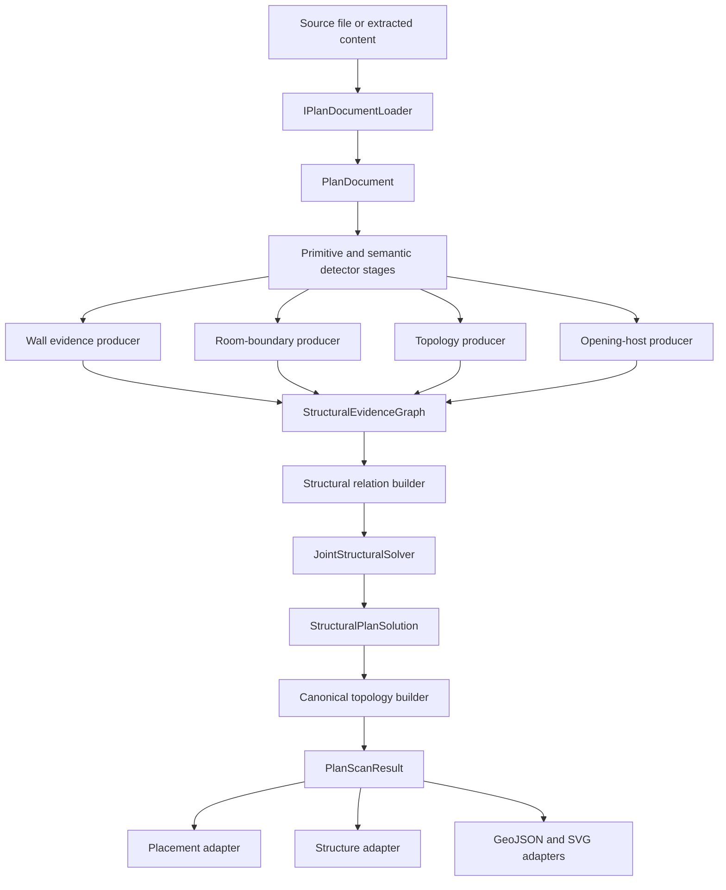

# OpenPlanTrace Architecture

OpenPlanTrace is a standalone .NET plan interpretation engine. It owns source
normalization, deterministic analysis, structural inference, diagnostics, and
portable output contracts. It does not depend on a downstream application.

## Design Goals

- Preserve exact source coordinates and provenance.
- Prefer evidence fusion over detector-order side effects.
- Keep uncertain and rejected evidence available for audit.
- Produce deterministic results from deterministic inputs.
- Separate structural interpretation from downstream placement policy.
- Allow optional AI adapters without making AI a prerequisite.
- Keep PDF, DXF, DWG-derived, raster, and clipboard inputs behind loaders.

## Data Flow

## Ownership Boundaries

### Source Adapters

Loaders translate a source format into normalized `PlanDocument` primitives.
They report source capabilities and limitations honestly. A DWG bridge, OCR
engine, or raster vectorizer belongs here and may be distributed separately.

### Detector Stages

Detectors produce observations such as walls, room boundaries, openings,
dimensions, text, grid axes, and objects. Their output is evidence, not the
final global structural truth. Each stage declares its artifact dependencies
and emits confidence, source IDs, and diagnostics.

### Structural Evidence

`StructuralEvidenceGraph` is the canonical inference input. It contains:

- retained wall candidates, including preliminary rejects
- typed positive and negative signals
- duplicate, continuation, junction, conflict, room, and opening relations
- room-boundary loops
- junction candidates
- opening-host constraints
- producer and source provenance

Evidence producers are independent and append facts to candidate records.
They must not silently delete another producer's evidence.

### Joint Solver

`JointStructuralSolver` chooses a coherent candidate set with an explicit
objective:

- unary detector and source confidence
- duplicate and conflict constraints
- continuation and junction support
- room-boundary coverage and closure
- exterior-shell continuity
- opening-host support
- negative non-wall evidence

The solver is deterministic. Every candidate receives a selected, rejected,
retained-for-review, or invalid decision with reasons and contribution scores.

### Guarded Canonical Arbitration

The joint solver proposes a structural-core hypothesis. The global wall solver
also evaluates conservative, balanced, and recall-first hypotheses over the
same provenance-bearing candidate pool. The core is retained by default, but a
different hypothesis may become canonical when it materially improves the
objective or major-wall recall while passing long-wall, room-closure,
duplicate, review-burden, noise, and selected-length guards. This prevents an
incomplete structural pass from silently deleting stronger wall evidence
without allowing a speculative high-recall profile to bypass structural
rejections. Before arbitration, the core may recover a candidate selected by
all three fallback profiles only when clean graph geometry is coordinate-ready,
structural evidence and endpoint/opening/room context agree, negative evidence
is bounded, and the candidate contributes meaningful uncovered wall length.

### Canonical Topology

The topology builder turns selected candidates into stable structural geometry.
It robustly fits wall axes, compacts collinear observations into long wall
runs, resolves source-linked exterior body leaves into one physical wall
assembly, preserves contributing source IDs, and records T-junctions or
crossings as inline references. A branch does not force a long host wall into
many serialized fragments.

### Trust And Placement

Structural selection is deliberately high recall. Selection means that a
candidate contributes to the best current structural hypothesis; it does not
automatically mean that another application should place exact content on it.
Canonical wall-run reliability is authoritative for placement. It combines
independent wall-body coverage with typed negative evidence and indoor,
outdoor, or conflicted room-loop context; legacy detector readiness may add
provenance but cannot promote a structurally blocked run.

The placement adapter preserves three outcomes:

- coordinate-ready geometry
- retained review geometry
- rejected or omitted evidence

Export adapters may add format-specific validation, opening intervals, wall
body polygons, metric coordinates, or compact serialization. They must consume
the selected audited global hypothesis rather than inventing another one.

## Pipeline Execution

The current executor is a deterministic stage chain. Its metadata already
describes artifact reads, writes, dependency levels, execution waves,
capabilities, and rerun impact. This provides the contract for a future
dependency-driven scheduler without changing detector behavior in `0.11`.

A later scheduler should:

1. Build a dependency graph from stage metadata.
2. Run independent evidence producers concurrently.
3. Cache immutable artifacts by source and option fingerprints.
4. Invalidate only affected descendants after corrections.
5. Preserve deterministic ordering in merged evidence and diagnostics.

## Extension Rules

- Add source formats through `IPlanDocumentLoader`.
- Add structural observations through an evidence producer.
- Add cross-candidate behavior through a typed relation or objective factor.
- Add output formats as adapters over `PlanScanResult`.
- Add optional AI through typed model adapters with model/version provenance.
- Keep human corrections as explicit data, never hidden mutable state.
- Do not add downstream application dependencies to the engine.

## Testing Strategy

Structural changes should include:

- focused unit tests for evidence and objective behavior
- deterministic repeat-run tests
- topology and provenance contract tests
- full solution regression tests
- light, medium, and extreme real-plan scans
- walls-only screenshots inspected against the source PDF
- reviewed wall-truth metrics when truth data is available

Counts alone are not correctness. Visual alignment, missing major walls,
false structural details, room closure, coordinate readiness, and provenance
must all be reviewed.

## Planned Evolution

The next architecture steps are optional solver backends, sparse continuous
geometry refinement, uncertainty calibration, dependency-driven partial
reruns, correction-driven evidence updates, and benchmark-gated model
adapters. These extend the same evidence and solution contracts rather than
replacing deterministic scanning.
